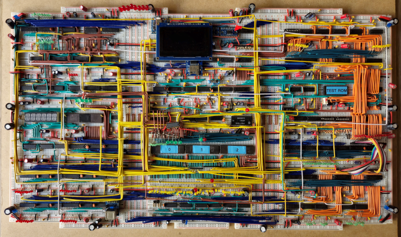

# CPU & GPU Project Notes

# The Gameboy Reference

- **Game Boy Development**
    - [https://gbdev.io/](https://gbdev.io/)
- Game Boy Docs
    - [https://gbdev.io/pandocs/Specifications.html](https://gbdev.io/pandocs/Specifications.html)
- **Part 1: The CPU**
    - [https://youtu.be/RZUDEaLa5Nw?si=pp9zKsSRu_aJUSTG](https://youtu.be/RZUDEaLa5Nw?si=pp9zKsSRu_aJUSTG)
- **Part 2: Memory Mapping**
    - [https://youtu.be/ecTQVa42sJc?si=fnIOLt88ZqXRLhJ2](https://youtu.be/ecTQVa42sJc?si=fnIOLt88ZqXRLhJ2)

8 bit processor, 16 bit address space

## Registers

[https://gbdev.io/pandocs/CPU_Registers_and_Flags.html](https://gbdev.io/pandocs/CPU_Registers_and_Flags.html)

| 16 Bit | 8 Bit | Description |
| --- | --- | --- |
| - | A | Accumulator |
| - | B | General Purpose |
| - | C | General Purpose |
| - | D | General Purpose |
| - | E | General Purpose |
| - | F | Flags |
| - | H | General Purpose |
| - | L | General Purpose |
| SP | - | Stack Pointer |
| PC | - | Program Counter |

```nasm
; 8 Bit Registers - A, B, C, D, E, F, H, L 
; 16 Bit Registers - SP(Stack Pointer), PC(Program Counter)

; Register A => Accumulator for math operations
; Register F => Flags
```

## Memory (RAM/VRAM)

[https://gbdev.io/pandocs/Memory_Map.html](https://gbdev.io/pandocs/Memory_Map.html)

```nasm
; Memory range: 0x0000 => 0xFFFF

; Cartridge (32 KB):             0x0000 => 0x7FFF
; VRAM (8 KB):                   0x8000 => 0x9FFF
	; Used for tile maps	
; External RAM (8 KB):           0xA000 => 0xBFFF
	; Used for game saves
; Work RAM (8 KB):               0xC000 => 0xDFFF
; Forbidden Work RAM (8 KB):     0xE000 => 0xFDFF
; Special:
	; Object Attribute Table:      0xFE00 => 0xFE9F
	; Prohibited:                  0xFEA0 => 0xFEFF
	; Peripherals:                 0xFF00 => 0xFF7F
	; High Ram:                    0xFF80 => 0xFFFE
		; Developers can use it
	; Interrupt Switch                       0xFFFF
```

## Instruction Reference

[https://youtu.be/RZUDEaLa5Nw?si=m5g1Lza0JrrYZvhJ&t=264](https://youtu.be/RZUDEaLa5Nw?si=m5g1Lza0JrrYZvhJ&t=264)

| LD | LDI | LDD | PUSH | POP | ADD | ADC |
| --- | --- | --- | --- | --- | --- | --- |
| SUB | SBC | AND | XOR | OR | CP | INC |
| DEC | DAA | RLCA | RLA | RRCA | RRA | RLC |
| RL | RRC | RR | SLA | SRA | SRL | SWAP |
| BIT | SET | RES | CCF | SCF | NOP | HALT |
| STOP | DI | EI | JP | JR | CALL | RET |
| RETI | RST |  |  |  |  |  |

# **F8-BB: Expanded 8-bit Breadboard CPU**

[https://github.com/Fadil-1/8-BIT-BREADBOARD-CPU](https://github.com/Fadil-1/8-BIT-BREADBOARD-CPU)



# CPU Reference

## Notes

- Helpful Tips and Recommendations
    - [https://www.reddit.com/r/beneater/comments/ii113p/helpful_tips_and_recommendations_for_ben_eaters/](https://www.reddit.com/r/beneater/comments/ii113p/helpful_tips_and_recommendations_for_ben_eaters/)
- Math Operations
    - https://www.reddit.com/r/beneater/comments/1ed6e4b/ic_suggestions_for_more_complex_math_operations/
    - Use the ALU (74LS181) to use basic math and logic operations
    - Just reuse the ALU already in your CPU, and implement the multiplication/division algorithms in microcode
- Barrel Shifter
    - Probably isn’t practical as it requires a too many multiplexers
    - Maybe code it in assembly to emulate the behavior of shifting?
- Breadboard layout
    - Breadboards ⇒ 3W x 11H
    - Bus Lines ⇒ 4W x 3H
    - Breadboard |—| Bus Line |—| Breadboard |—| Bus Line |—| Breadboard

## Schematic Overview

https://www.canva.com/

[https://canva.link/m14ju3rawmeu193](https://canva.link/m14ju3rawmeu193)